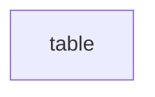

## Objective:
Take a working directory and create a folder structure for the tiled files for monogame tile_manager library for reading monogame build pipline strings.

```mermaid
graph TD

table

```